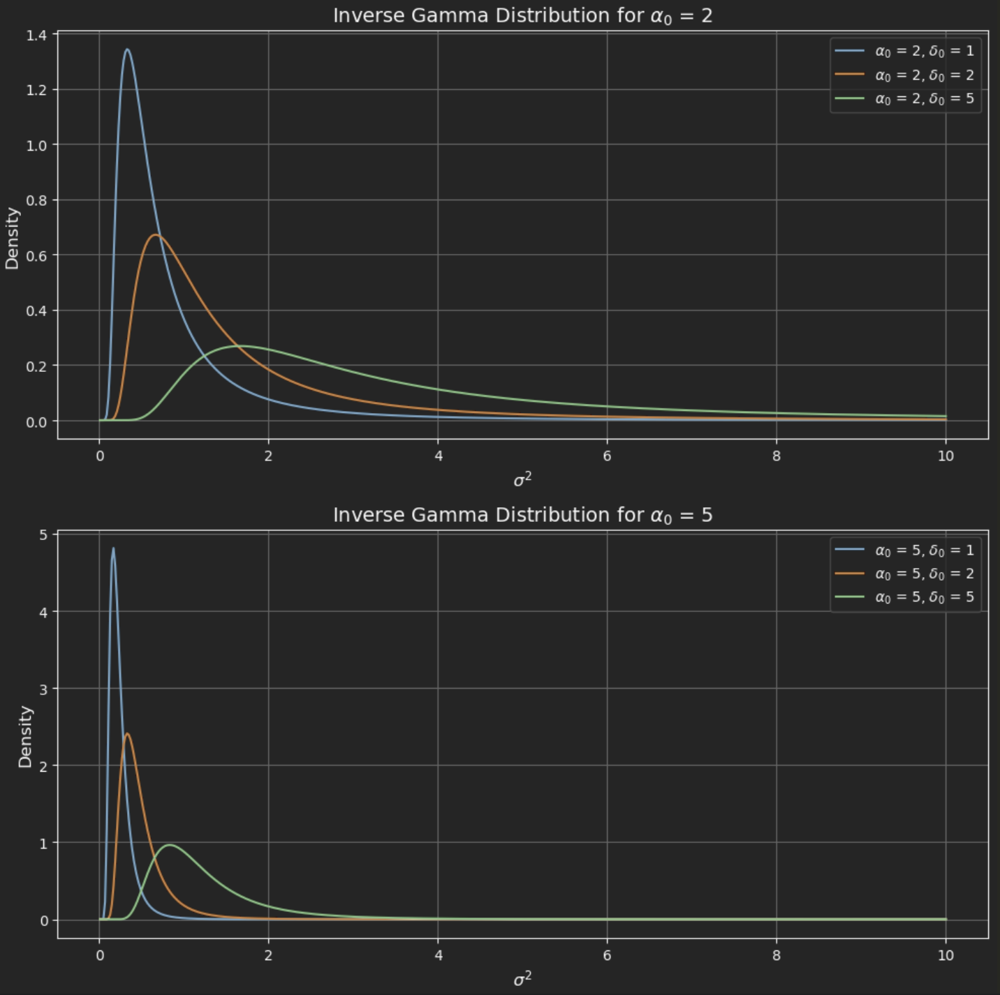

# 2.1 다중선형회귀모형

## 요약
다중선형회귀모형은 여러 독립변수를 사용하여 종속변수를 예측하는 통계적 방법입니다. 빈도주의 접근법에서는 최소자승추정량을 사용하여 회귀계수를 추정하며, 베이지안 접근법에서는 사전 분포를 설정하고 데이터를 통해 사후 분포를 갱신합니다. 베이지안 접근법은 사전 정보와 데이터의 균형을 통해 보다 유연한 추정을 가능하게 합니다.
- 베이지안회귀
- 사전분포
- 사후분포

## 다중선형회귀모형의 기본형

$Y = X_1 \beta_1 + X_2 \beta_2 + \dots + X_k \beta_k + e$

- $Y$는 종속변수 벡터 ($T \times 1$)
- $X_1, X_2, \dots, X_k$는 독립변수들 ($T \times 1$)
- $\beta_1, \beta_2, \dots, \beta_k$는 회귀계수들 ($k \times 1$)
- $e$는 오차항 벡터 ($T \times 1$)
- 회귀식은 오차항 $e$가 정규분포를 따르는 것으로 가정
$e | X_1, X_2, \dots, X_k \sim \text{Normal}(0, \sigma^2 I_T)$
$Y | X, \beta, \sigma^2 \sim \text{Normal}(X\beta, \sigma^2 I_T)$

## 빈도주의 선형회귀

클래식한 가정 하에서 회귀계수를 추정하기 위해 사용하는 최소자승추정량은 다음과 같이 주어집니다

$\hat{\beta}_{OLS} = (X'X)^{-1}X'Y$

## 베이지안 선형회귀

베이지안 방법론을 사용하여 선형 회귀식을 추정할 때, 회귀 계수 $\beta$와 잔차 분산 $\sigma^2$에 대해 **사전 분포**를 설정하고, 이를 데이터에 의한 **사후 분포**로 갱신하는 과정이 이루어집니다. 

### 사전분포 
사전 분포에 대한 연구자의 믿음은 경제이론이나 과거의 통계적 지식을 바탕으로 설정되며, 사후 분포는 주어진 데이터와 사전 정보가 결합되어 결정됩니다. 여기서, $\alpha_0$, $\delta_0$, $\beta_0$, $B_0$는 사전 분포의 하이퍼파라미터를 나타내며, 이 값들은 연구자의 사전 지식에 의해 설정됩니다. 이러한 하이퍼 파라미터는 연구자의 사전 믿음을 반영하지만, 지나치게 강력한 사전 정보는 사후 분포에 영향을 크게 미칠 수 있습니다. 따라서 하이퍼 파라미터를 설정할 때는 데이터를 고려해 적절한 사전 정보의 강도를 설정해야 합니다. 만약 하이퍼 파라미터를 통해 얻은 사전 정보가 충분히 강력하면, 데이터에 포함된 정보가 사후 추정에 미치는 영향이 줄어들게 됩니다. 반면, 사전 정보가 약할 경우 데이터가 추정에 더 큰 영향을 미치게 됩니다.

- 회귀계수 $\beta$에 대한 정규분포 사전분포:
  $\beta \sim \text{Normal}(\beta_0, \sigma^2 B_0)$
  
  1. 하이퍼파라미터 ($\beta_0$, $B_0$)
    1.1. $\beta_0$: $\beta$의 사전 분포 평균
         - 연구자의 선험적 믿음을 반영
         - $\beta$가 어떤 값에 가까울 것인지를 나타냄     
    1.2. $\sigma^2 B_0$: $\beta$의 사전 분포 분산
         - $\beta$의 불확실성을 조절
         - 분산이 클수록 연구자의 사전 정보가 덜 확신적임을 의미

         

  2. $\sigma^2 B_0$를 사전 분산으로 사용하는 이유
     2.1. 사후 분포 도출의 용이성
         - $\beta$의 사전 분산이 $\sigma^2$와 연동되면 계산이 간단해짐
         - 모수 추정에 도움이 됨
     
     2.2. 오차항 크기와 사전 정보의 관계 반영
         - $\sigma^2$가 클수록 연구자의 사전 정보(믿음)가 약해짐
         - 데이터의 정보량이 많을수록 사전 정보의 영향력이 감소함

]

### Case 분석

#### 2.1.1 Case 1: $\sigma^2$가 알려진 경우

##### 1) 베타의 사후분포 도출
- $\pi(\beta | Y) \propto f(Y | \beta) \pi(\beta)$

위 식에서 우도함수 $f(Y | \beta)$와 사전 분포 $\pi(\beta)$는 각각 정규 분포이므로, 두 분포를 곱하여 새로운 정규 분포 형태의 사후 분포를 얻습니다.
사후 분포 $\pi(\beta | Y)$는 다음과 같은 형태를 가지게 됩니다.
- $\pi(\beta | Y) \propto \exp\left(-\frac{1}{2\sigma^2} \left[ (Y - X\beta)'(Y - X\beta) + (\beta - \beta_0)'B_0^{-1}(\beta - \beta_0) \right] \right)$

위 식을 정리하면, $\beta$의 사후 분포는 다음과 같은 다변량 정규분포로 나타낼 수 있습니다.
- $\beta | Y \sim \text{Normal}(B_1 A, \sigma^2 B_1)$
    - $B_1 = (X'X + B_0^{-1})^{-1}$
    - $A = X'Y + B_0^{-1} \beta_0$
- 즉, $\beta$의 사후 분포는 데이터로부터 계산된 사후 평균 $B_1 A$와 사후 분산 $\sigma^2 B_1$을 따르게 됩니다.

##### 2) 베타의 사후 분포의 특징
$\beta$의 사후 평균 $B_1 A$는 사전 정보 $\beta_0$와 OLS 추정값 $\hat{\beta}_{OLS}$의 가중 평균입니다. 이를 식 (2.14)로 나타내면 다음과 같습니다.
- $E(\beta | Y) = B_1 A = \frac{X'Y + B_0^{-1} \beta_0}{X'X + B_0^{-1}}$

$B_1$은 사후 분포의 분산을 나타내며, 데이터로부터 얻은 정보($X'X$)와 사전 정보($B_0^{-1}$)를 결합한 가중치를 나타냅니다. 이때 데이터에 대한 정보가 많아질수록 ($X'X$가 커질수록) $\beta$의 사후 평균은 데이터에 더 크게 의존하고, 사전 분포의 영향은 줄어듭니다.

- $B_1 A = \frac{1}{1 + \frac{\text{Var}(\hat{\beta}_{OLS})}{\text{Var}(\beta)}} \hat{\beta}_{OLS} + \left(1 - \frac{1}{1 + \frac{\text{Var}(\hat{\beta}_{OLS})}{\text{Var}(\beta)}} \right) \beta_0$

이 식에서 **가중치**는 데이터 기반 추정치 $\hat{\beta}_{OLS}$와 사전 정보 $\beta_0$ 사이의 균형을 나타냅니다. 
  - **데이터의 신뢰성**이 높을 때 (즉, $\text{Var}(\hat{\beta}_{OLS})$가 작을 때) 사후 평균은 데이터 기반 OLS 추정값에 더 가까워지고, 
  - 반대로 **데이터의 신뢰성**이 낮을 때 (즉, $\text{Var}(\hat{\beta}_{OLS})$가 클 때) 사후 평균은 사전 평균 $\beta_0$에 더 가깝게 수렴합니다.

- OLS 추정치의 분산이 커질수록, 즉 데이터에 대한 정보가 적을수록 사후 평균은 사전 정보에 더 크게 의존하게 되며, 사후 분포는 사전 분포와 유사한 형태를 갖게 됩니다. 
- 반대로, 데이터가 많고 OLS 추정치의 분산이 작아질수록 사후 평균은 $\hat{\beta}_{OLS}$에 가까워집니다. 이는 사후 분포가 데이터 기반 정보를 더 많이 반영한다는 의미입니다.

##### 3) 하이퍼 파라미터의 선택

1. **$B_0$ (사전 분산-공분산 행렬)**:
   - **$B_0$가 클 경우**:
      - 사전 분포가 더 넓어짐: $\beta$의 사전 분포가 넓어져 사전 정보가 덜 구체적임을 의미합니다.
      - 데이터 정보의 영향이 커짐: 사후 평균이 OLS 추정값 $\hat{\beta}_{OLS}$에 더 가깝게 수렴합니다.
      - 사후 분포가 넓어질 가능성: 불확실성이 증가하고 데이터의 영향을 강하게 반영합니다.
   - **$B_0$가 작을 경우**:
      - 사후 분포가 연구자의 사전 믿음에 더 가깝게 수렴합니다.
      - 데이터 정보는 상대적으로 덜 반영됩니다.
      

1. **$B_0$ (사전 분산-공분산 행렬)**:
   - **$B_0$가 클 경우**:
      - 사전 분포가 더 넓어짐: $\beta$의 사전 분포가 넓어져 사전 정보가 덜 구체적임을 의미합니다.
      - 데이터 정보의 영향이 커짐: 사후 평균이 OLS 추정값 $\hat{\beta}_{OLS}$에 더 가깝게 수렴합니다.
      - 사후 분포가 넓어질 가능성: 불확실성이 증가하고 데이터의 영향을 강하게 반영합니다.
   - **$B_0$가 작을 경우**:
      - 사후 분포가 연구자의 사전 믿음에 더 가깝게 수렴합니다.
      - 데이터 정보는 상대적으로 덜 반영됩니다.

이와 반대로, **$B_0$ 값을 작게 설정**하면, 사후 분포는 연구자의 사전 믿음에 더 가깝게 수렴하게 되고, 데이터 정보는 상대적으로 덜 반영됩니다.

#### 2.1.2 Case 2: $\sigma^2$가 알려지지 않은 경우

##### 1) 시그마의 사후분포 도출

##### 2) 시그마의 사후분포의 특징

##### 3) 하이퍼 파라미터의 선택

1. **$\alpha_0$ (Shape Parameter)**:
   - $\alpha_0$가 클수록 : 분포의 형태가 더 좁아지고 날카로워지며, 이는 $\sigma^2$에 대한 더 확신된 정보를 반영합니다. 즉, $\alpha_0$가 클수록 사후 분포가 데이터에 의해 더 영향을 받아 분포가 ��족해집니다.
   - $\alpha_0$가 작을수록 : 분포는 더 넓고, 불확실성이 높아집니다. 연구자의 사전 정보가 덜 확실한 상황일 때 작은 $\alpha_0$ 값을 선택할 수 있습니다.
   - 사후 분포에서 $\alpha_1 = a_0 + T$와 같이 데이터의 표본 크기와 더불어 사후 분포에 반영됩니다.

2. **$\delta_0$ (Scale Parameter)**:
   - $\delta_0$가 클수록 : 분포의 스케일이 커지고, 이는 $\sigma^2$에 대한 더 넓은 불확실성을 의미합니다. $\sigma^2$가 다양한 값일 가능성이 높다는 것을 의미하며, 사전 정보가 덜 확신적일 때 $\delta_0$를 크게 설정할 수 있습니다.
   - $\delta_0$가 작을수록 : 분포의 스케일이 작아져 $\sigma^2$에 대한 더 좁은 불확실성을 의미합니다. 이는 $\sigma^2$의 값에 대한 연구자의 확신이 높다는 것을 나타냅니다.
   - 사후분포에서 $\delta_1 = \delta_0 + (Y - X\beta)'(Y - X\beta)$로, $\delta_0$는 데이터와 관련된 잔차항과 더불어 $\sigma^2$의 사후 분포에 반영됩니다.

#### 2.1.3 Case 3: $\beta$와 $\sigma^2$ 모두 알려지지 않은 경우

이 경우는 가장 일반적인 상황으로, $\beta$와 $\sigma^2$ 모두에 대해 사전분포를 설정하고, 데이터를 통해 이 둘의 결합 사후분포�� 계산하는 과정이 필요합니다. $\beta$와 $\sigma^2$는 서로 독립적이지 않고 결합된 형태로 존재하며, 이를 베이지안 방법으로 처리하여 두 파라미터의 결합 사후분포를 계산합니다.

결합 사후분포는 다음과 같은 형태로 주어집니다.

$\pi(\beta, \sigma^2 | Y) \propto f(Y | \beta, \sigma^2) \pi(\beta, \sigma^2)$

여기서 $f(Y | \beta, \sigma^2)$는 결합 우도 함수로, 데이터가 주어졌을 때 $\beta$와 $\sigma^2$에 의존하는 확률을 나타냅니다. $\pi(\beta, \sigma^2)$는 $\beta$와 $\sigma^2$에 대한 결합 사전분포입니다. 이 결합 분포를 풀어서 계산하면, $\beta$와 $\sigma^2$의 결합된 사후분포가 각각 정규분포와 역감마분포의 결합 형태로 표현될 수 있습니다.

따라서 최종적으로 우리는 $\beta$에 대해 다음과 같은 결합 사후분포를 얻게 됩니다.

$\pi(\beta | Y, \sigma^2) \sim \text{Normal}(\hat{\beta}, V_{\beta})$
$\pi(\sigma^2 | Y) \sim \text{InverseGamma}\left( \frac{a_1}{2}, \frac{\delta_1}{2} \right)$

이때 $\hat{\beta}$는 사전정보�� 데이터를 반영한 사후평균, $V_{\beta}$는 사후분산입니다.