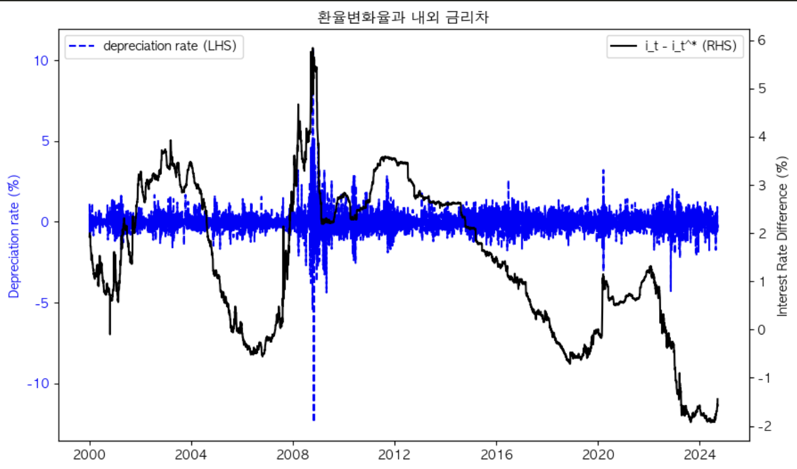

# 2.2.6 연습문제 유위험 이자율 평형

## 데이터

|                | korea_cd_quarterly | treasury_3month_quarterly | usd_krw_quarterly |
|----------------|--------------------|---------------------------|-------------------|
| 2000-03-31     | 7.01               | 5.88                      | 1106.0            |
| 2000-06-30     | 7.18               | 5.88                      | 1115.0            |
| 2000-09-30     | 7.05               | 6.23                      | 1115.0            |
| 2000-12-31     | 6.88               | 5.89                      | 1264.5            |
| 2001-03-31     | 5.70               | 4.30                      | 1327.5            |
| ...            | ...                | ...                       | ...               |
| 2023-09-30     | 3.83               | 5.55                      | 1349.3            |
| 2023-12-31     | 3.83               | 5.40                      | 1288.0            |
| 2024-03-31     | 3.64               | 5.46                      | 1347.2            |
| 2024-06-30     | 3.60               | 5.48                      | 1376.7            |
| 2024-09-30     | 3.53               | 4.97                      | 1329.5            |


분기데이터


cf) 책 데이터


일간데이터



## 깁스샘플링코드


```python
def run_bayesian_regression(exchange_rate_change, interest_rate_diff):
    T = len(exchange_rate_change)
    # 2. 선형 회귀 모형 설정
    with pm.Model() as model:
        # 사전 분포 설정
        alpha0 = 50
        beta0 = 1000 * alpha0
        sigma2 = pm.InverseGamma('sigma2', alpha=alpha0 / 2, beta=beta0 / 2)
        beta = pm.MvNormal('beta', mu=np.array([0, 1]), cov=25 * np.eye(2), shape=2)

        # 설명변수 X 구성
        X = np.column_stack([
            np.ones(T),  # 상수항 a1
            interest_rate_diff  # i_t - i_t^*
        ])

        # 종속변수 Y
        Y = exchange_rate_change

        # 우도 함수 설정 (선형 회귀)
        Y_obs = pm.Normal('Y_obs', mu=pm.math.dot(X, beta), sigma=pm.math.sqrt(sigma2), observed=Y)

        # 5000번 샘플링
        # cores는 병렬로 샘플링을 수행할 CPU 코어의 수를 의미하고, chains는 독립적으로 샘플링을 수행할 체인의 수를 의미합니다.
        # 사용 가능한 코어 수가 7개이므로 cores를 7로 설정합니다.
        # chains는 일반적으로 4로 설정하는 것이 좋습니다.
        trace = pm.sample(5000, cores=7, chains=4)

    # 추정 결과 시각화
    pm.plot_trace(trace)
    plt.show()

    # 추정된 값 요약
    summary = pm.summary(trace)
    print(summary)

```

## 결과


1. **왼쪽 상단 플롯 (beta의 밀도 플롯)**:
   - 이 플롯은 회귀 계수 `beta`의 사후 분포를 나타냅니다.
   - 주황색 선은 `beta[0]` (상수항)의 사후 분포를 나타내고, 파란색 선은 `beta[1]` (이자율 차이의 계수)의 사후 분포를 나타냅니다.
   - x축은 `beta` 값의 범위를, y축은 해당 값의 밀도를 나타냅니다.

2. **오른쪽 상단 플롯 (beta의 트레이스 플롯)**:
   - 이 플롯은 샘플링 과정에서 `beta` 값이 어떻게 변화했는지를 보여줍니다.
   - 주황색 점들은 `beta[0]`의 샘플링 값을, 파란색 점들은 `beta[1]`의 샘플링 값을 나타냅니다.
   - x축은 샘플링 횟수를, y축은 `beta` 값의 범위를 나타냅니다.

3. **왼쪽 하단 플롯 (sigma2의 밀도 플롯)**:
   - 이 플롯은 잔차 분산 `sigma2`의 사후 분포를 나타냅니다.
   - 파란색 선은 `sigma2`의 사후 분포를 나타냅니다.
   - x축은 `sigma2` 값의 범위를, y축은 해당 값의 밀도를 나타냅니다.

4. **오른쪽 하단 플롯 (sigma2의 트레이스 플롯)**:
   - 이 플롯은 샘플링 과정에서 `sigma2` 값이 어떻게 변화했는지를 보여줍니다.
   - 파란색 점들은 `sigma2`의 샘플링 값을 나타냅니다.
   - x축은 샘플링 횟수를, y축은 `sigma2` 값의 범위를 나타냅니다.


### 추정 결과 요약

다음은 깁스 샘플링을 통해 추정된 회귀 계수와 분산의 요약 통계입니다:

| Parameter | mean   | sd     | hdi_3%  | hdi_97% | mcse_mean | mcse_sd | ess_bulk | ess_tail | r_hat |
|-----------|--------|--------|---------|---------|-----------|---------|----------|----------|-------|
| beta[0]   | -0.034 | 2.218  | -4.141  | 4.171   | 0.020     | 0.014   | 12477.0  | 13910.0  | 1.0   |
| beta[1]   | 0.043  | 1.092  | -2.012  | 2.053   | 0.010     | 0.007   | 11800.0  | 13721.0  | 1.0   |
| sigma2    | 346.030| 41.244 | 272.779 | 425.630 | 0.307     | 0.220   | 18329.0  | 13801.0  | 1.0   |

위 표는 각 파라미터의 평균(mean), 표준편차(sd), 3% 및 97% 신뢰구간(hdi_3%, hdi_97%), Monte Carlo 표준 오차(mcse_mean, mcse_sd), 유효 샘플 크기(ess_bulk, ess_tail), 그리고 r_hat 값을 보여줍니다. 

- **beta[0]**: 상수항의 회귀 계수
- **beta[1]**: 이자율 차이의 회귀 계수
- **sigma2**: 잔차 분산

이 결과는 베이지안 회귀 분석을 통해 얻어진 것으로, 각 파라미터의 사후 분포에 대한 요약 통계를 제공합니다. r_hat 값이 1에 가까운 것은 샘플링이 잘 수렴했음을 의미합니다.

### 원래 연구와의 비교


원래 연구에서 제시된 결과는 다음과 같습니다:

| 파라미터 | 평균  | 표준오차 | 95% 신뢰구간 |
|----------|-------|----------|--------------|
| a1       | -1.70 | 2.82     | [-7.20, 3.83]|
| a2       | 1.30  | 1.33     | [-1.29, 3.93]|
| sigma2   | 392.30| 59.21    | [292.12, 527.15]|

원래 연구와 비교했을 때, 다음과 같은 차이점이 있습니다:

- **상수항 (a1)**: 원래 연구에서는 평균이 -1.70으로 추정되었으나, 레플리케이트한 결과에서는 beta[0]의 평균이 -0.034로 나타났습니다.
- **이자율 차이 (a2)**: 원래 연구에서는 평균이 1.30으로 추정되었으나, 레플리케이트한 결과에서는 beta[1]의 평균이 0.043으로 나타났습니다.
- **잔차 분산 (sigma2)**: 원래 연구에서는 평균이 392.30으로 추정되었으나, 레플리케이트한 결과에서는 346.030으로 나타났습니다.

이러한 차이점은 데이터의 차이, 사전 분포 설정의 차이, 또는 샘플링 방법의 차이에서 기인할 수 있습니다. 그러나 전반적으로 두 결과는 유사한 경향을 보이며, 특히 r_hat 값이 1에 가까운 것은 샘플링이 잘 수렴했음을 의미합니다.
