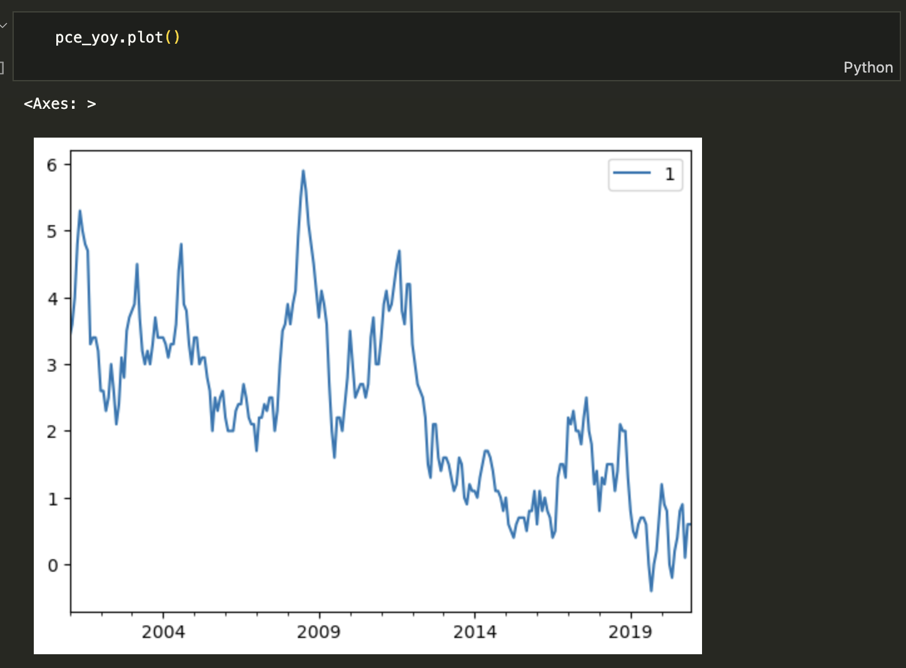
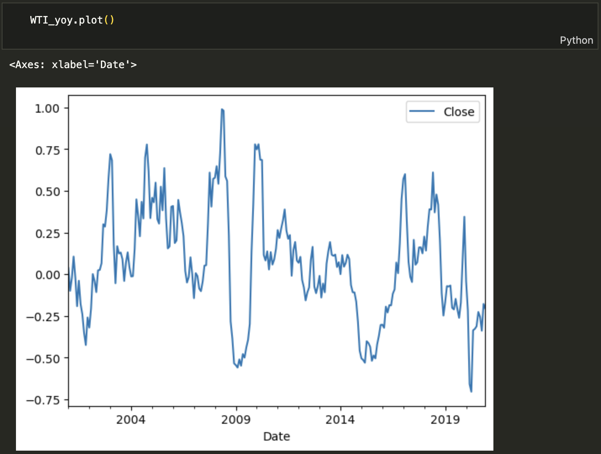
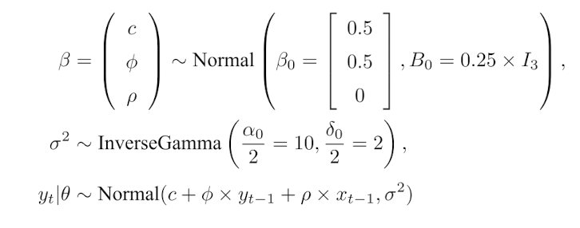
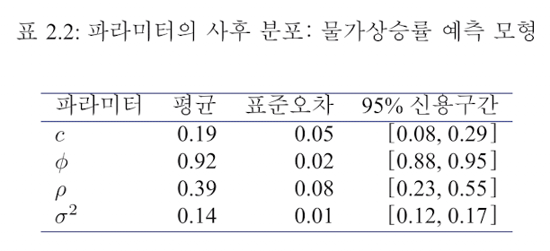
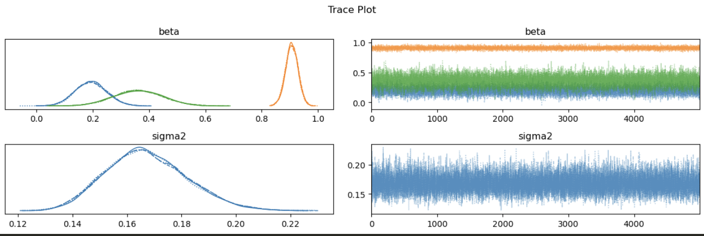
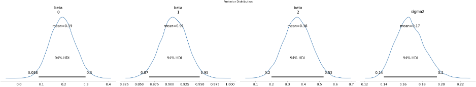

# 2.2.7 연습문제: 우리나라 물가상승률 예측모형

## 데이터 로드 및 전처리

- `pce_yoy`: 2000년 12월부터 2020년 12월까지의 우리나라 물가상승률 데이터

- `WTI_yoy`: 2000년 12월부터 2020년 12월까지의 WTI 원유 가격 상승률 데이터



### 모델링


```python

y = pce_yoy.values  # 물가상승률 데이터 (대체)
x = WTI_yoy.values # 설명 변수 데이터

# PyMC 모델 시작
with pm.Model() as model:

    # 파라미터 설정: c, ϕ, ρ
    beta_prior = pm.MvNormal(
        'beta', 
        mu=np.array([0.5, 0.5, 0]), 
        cov=0.25 * np.eye(3), 
        shape=3
    )
    c_prior   = beta_prior[0]
    phi_prior = beta_prior[1]
    rho_prior = beta_prior[2]

    # 시그마^2 (σ^2)의 InverseGamma 분포
    sigma2_prior = pm.InverseGamma('sigma2', alpha=10, beta=2)

    # 선형 회귀식: y_t = c + ϕ * y_t-1 + ρ * x_t + σ
    mu = c_prior + phi_prior * np.roll(y, 1) + rho_prior * np.roll(x, 1)

    # 관측된 데이터의 likelihood
    y_obs = pm.Normal('y_obs', mu=mu, sigma=np.sqrt(sigma2_prior), observed=y)

    # 샘플링
    trace = pm.sample(5000, return_inferencedata=True)
```

### 결과 요약
책의 결과와 유사한 값 

### Summary Statistics

|          | mean  | sd    | hdi_3% | hdi_97% | mcse_mean | mcse_sd | ess_bulk | ess_tail | r_hat |
|----------|-------|-------|--------|---------|-----------|---------|----------|----------|-------|
| beta[0]  | 0.194 | 0.056 | 0.088  | 0.298   | 0.001     | 0.000   | 10484.0  | 12149.0  | 1.0   |
| beta[1]  | 0.907 | 0.022 | 0.866  | 0.950   | 0.000     | 0.000   | 10016.0  | 11462.0  | 1.0   |
| beta[2]  | 0.362 | 0.087 | 0.199  | 0.526   | 0.001     | 0.001   | 12967.0  | 12721.0  | 1.0   |
| sigma2   | 0.167 | 0.015 | 0.140  | 0.195   | 0.000     | 0.000   | 17419.0  | 12427.0  | 1.0   |


